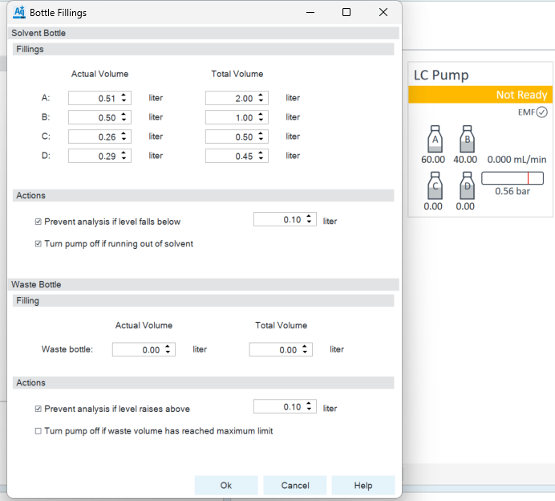
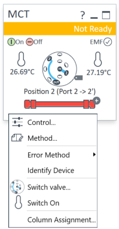
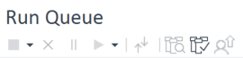
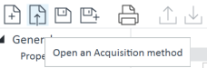
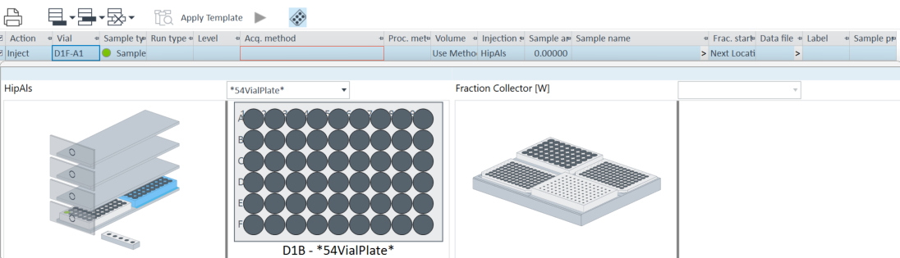
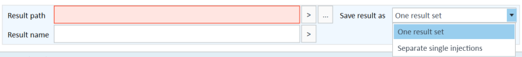

### OpenLab 

**Process**
1. Open Control panel app
2. Enter your username and password
3. Select the instrument wanted and click "launch"
4. Under "Status" you've got the main page

    4.1 "Instrument Status"

    If you click on the bottles the left window open. You can adjust bottles filling. The software tells when a bottle is empty.

    4.1.2

    This is the column part. Right click -> you can "Switch valve..." which is the column position in the machine and turn on and off the heat

    4.1.3 The other one have the same principes of control

    4.2

    4.2.1 The square allows to stop a running sequence

    4.2.2 The croos allows to cancel a pending sequence

    4.2.3 Then you've got the pause button -> it'll finish the current injection before pausing

    4.2.4 Then the restart button

    4.2.5 The vials with a magnifying glass allows to check a sequence and edit it

    4.2.6 The vials with a check is to open the result (data analysis)

    4.3 "Online signals" you can choose which module online signal you want to see

5. Go on "Method" from the main page (next to "Status")
6. **Open or create a method**

    6.1 "LC Pump" choose a flow, if you want an isocratic or gradient mode and the time of the analysis 

    6.2 "Sampler" choose an injection volume

    6.3 "MCT" can change the column temperature from start to the end of it, the position of the column in the instrument

    6.4 "DAD" choose the wavelength you want to analyse

    6.5 "Collector" put disabled if you don't need to collect or if you want to collect -> enabled, check 1st column in Peak Triggers, check "OR" in Trigger Combinations and create your Timetable on the right

    6.6 "SQ", "Acquisition" choose positive and/or negative scan mode, mass range depending on your molecule weight and check Fragmentor ramp

    6.7 "SQ", "Source" default parameters: Gas Flow = 13.0L/min; Nebulizer = 55.0 psi; Capillary Voltage 3500 V; Gas Temperature = 350°C

    6.8 "SQ", "Chromatograms" don't change 

    6.9 "SQ", "Timetable" create it depending on when you want your sample to go through the MS part

    6.10 "SQ", "Autotune" for the maintenance part

    6.11 "ELSD" default parameters: Evaporateur Temperature = 30°C; Nebulizer Temperature = 30°C; Gas Flow Rate = 80Hz

    6.12 "Valve" choose position 1 to 6 if you collect and 1 to 2 if you don't 

7. Send the method to the instrument to condition the column during 20-30 min (7th icon 6.)
8. Go on "Sequence" (next to "Method")
9. **Open or create a sequence** (same icons as 6.)

    9.1 "Vial" select the position of the vial 

    
    9.2 "Sample type" select which kind of sample you analyse 

    9.3 "Run type and "Level" don't touch 

    9.4 "Acquisition method" select the method wanted

    9.5 "Proc. method" don't touch -> you will choose during data processing 

    9.6 "Volume" = use method

    9.7 "Injection" = HipAls

    9.8 "Sample amount" don't touch 

    9.9 "Sample name" name it as you want 

    9.10 "Frac. start location" = next location except you're doing something special 

    9.11 "Label" don't touch 

    9.12 "Sample prep method" don't touch 

10.  at the bottom of the window
11. In "Result path" choose where you want to save the result by clicking on the "..."
11. In "result name" name your result 
12. "Save result as" if you select "One result set" you will have to wait for the whole sequence to finish before being able to see the results and for "Separate single injections" you'll have the result after each injection
13. Run the sequence by clicking on the green button "Run" at the bottom right
14. You can also do a "Single Sample Analysis" the same way as in "Sequence"

### VWorks
### Topspin