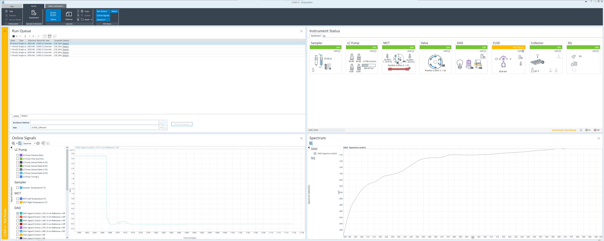

### OpenLab 

**Process**
1. Open Control panel app
2. Enter your username and password
3. Select the instrument wanted and click "launch"
4. Under "Status" you've got the main page
You can turn on and off the modules, see the online signal for each module and the sequences running and pending.
5. Go on "Method" from the main page (next to "Status")
6. **Open or create a method**

    6.1 "LC Pump" choose a flow, if you want an isocratic or gradient mode and the time of the analysis 

    6.2 "Sampler" choose an injection volume

    6.3 "MCT" can change the column temperature from start to the end of it, the position of the column in the instrument

    6.4 "DAD" choose the wavelength you want to analyse

    6.5 "Collector" put disabled if you don't need to collect or if you want to collect -> enabled, check 1st column in Peak Triggers, check "OR" in Trigger Combinations and create your Timetable on the right

    6.6 "SQ", "Acquisition" choose positive and/or negative scan mode, mass range depending on your molecule weight and check Fragmentor ramp

    6.7 "SQ", "Source" default parameters: Gas Flow = 13.0 ; Nebulizer = 55.0 ; Capillary Voltage 

7. Send the method to the instrument to condition the column (7th icon 6.)
8. Go on "Sequence" (next to "Method")
9. **Open a sequence or create a new one** (same icons as 6.)

    9.1 

### VWorks
### Topspin