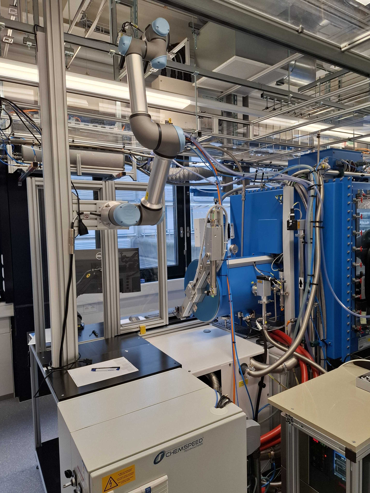
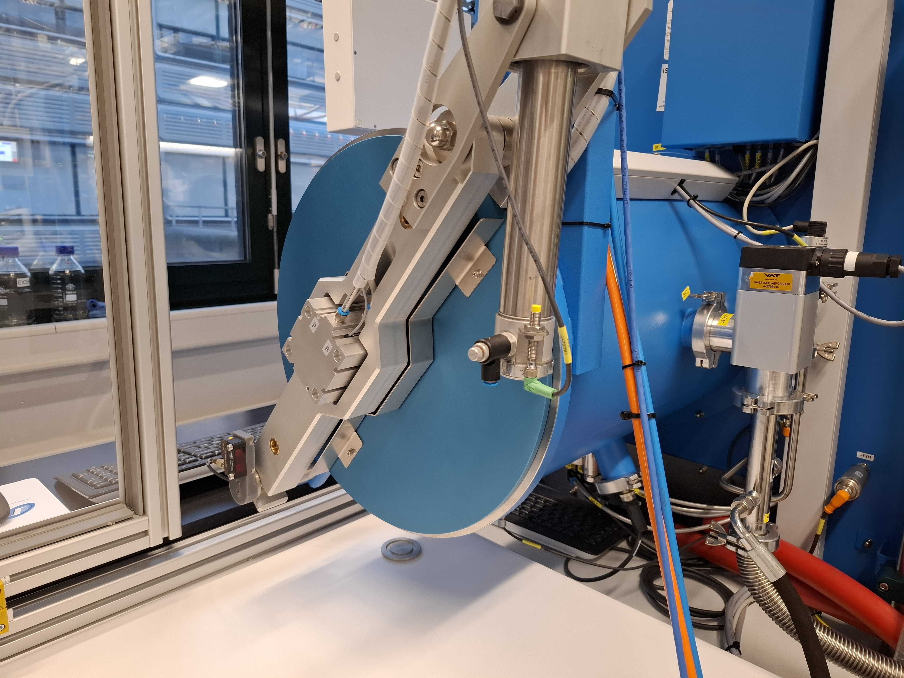
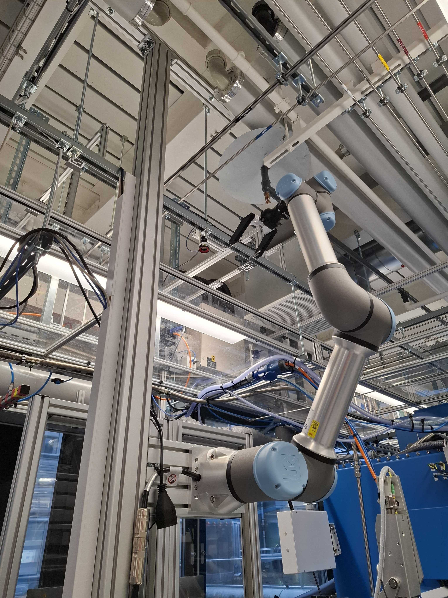
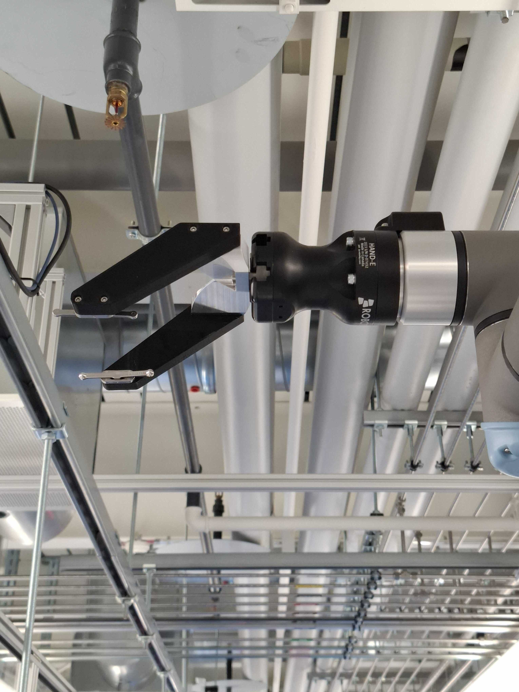
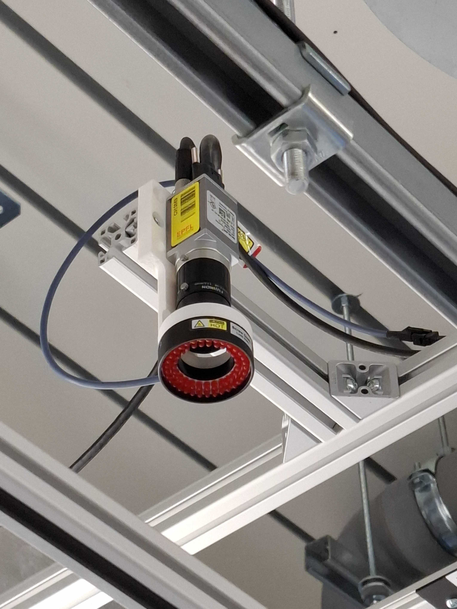
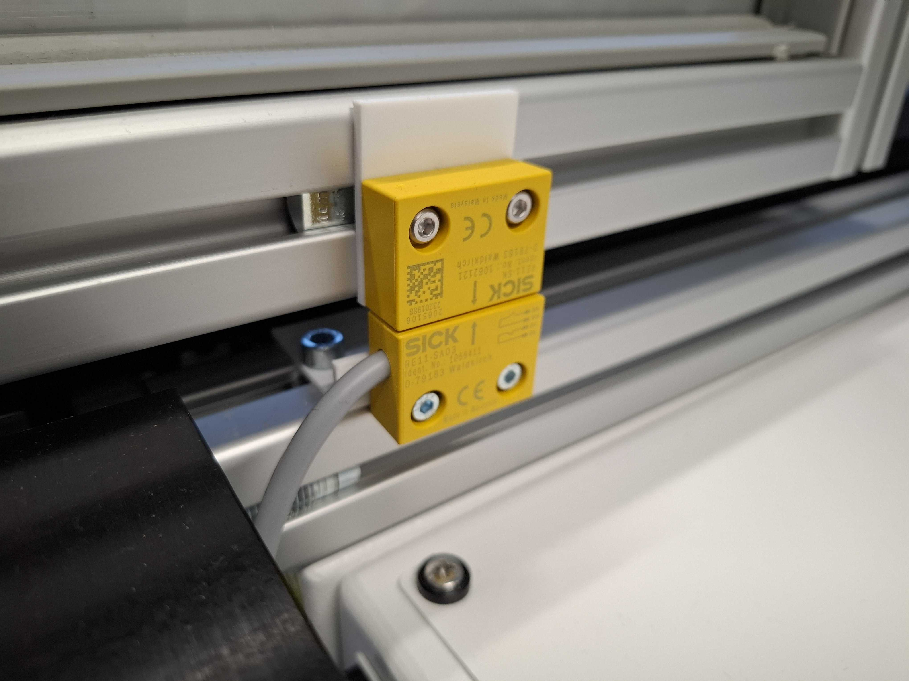
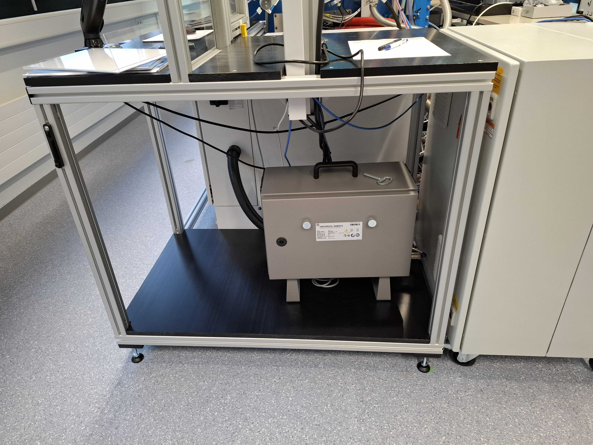

# Station Chemspeed

## General Purpose

The **Chemspeed Station** serves as the interface between the analytics and synthesis areas.

Once an experiment plate is completed in the Chemspeed systems, it is transferred to the **MBraun glovebox airlock chamber**.  
Several vacuum cycles are performed to prepare the samples for safe exposure to the laboratory atmosphere.

After the airlock sequence is completed:

1. The airlock doors open  
2. The drawer extends outward  
3. The Universal Robot (UR) retrieves the plate  
4. The plate is placed onto the Mobile Robot positioned on the track  

---

## Interlock

The **Universal Robot controller** and the **Chemspeed Autosuite control software** are connected via I/O signals.

This allows both systems to operate under an interlock mechanism, ensuring synchronized operation despite being managed by separate schedulers.

---

## Safety

To ensure operator safety:

- The Universal Robot safety system is connected to a proximity sensor.
- The sensor detects whether the protective door is open.
- If the door is opened, the robot immediately stops.

This guarantees safe human-robot interaction during operation.

---

## Code Repository

The Universal Robot programs are available in the following repository:

[Universal Robot Programs](https://github.com/swisscatplus/Auto_Analytic_UR){: .btn .btn-purple }

---

## Station Overview

---

## Components

### MBraun Airlock Chamber

---

### Universal Robot UR5e & Controller

---

### Robot Gripper

---

### Industrial Camera

---

### Aluminium Profile & Plexiglas Door with Presence Sensor

---

### Aluminium Profile Table

