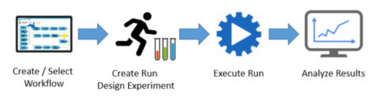
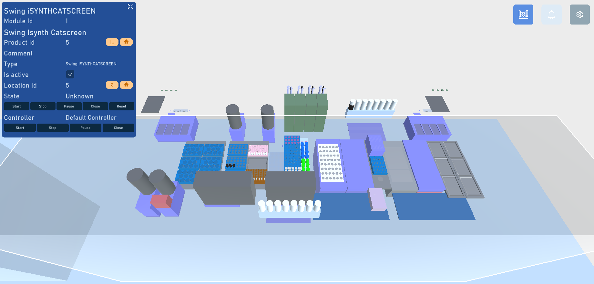
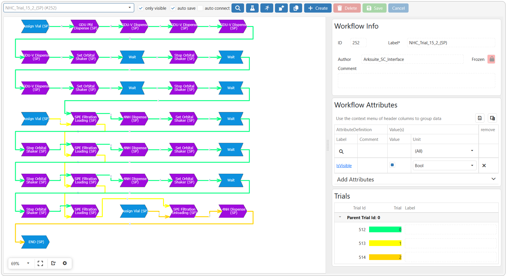

# ArkSuite – Data-Centric Experiment Management  

**ArkSuite** is a data-driven software environment.  
Unlike AutoSuite, which mainly focuses on **instrument control and task execution**, ArkSuite emphasizes **data organization, experiment design and management**.  
**Platforms**: CatScreen, Swing SP. 

<!-- Image: ArkSuite overview -->

---

## Advantages of ArkSuite compared to AutoSuite  

- **Data-centric architecture**  
  ArkSuite stores all experimental information in a structured, relational way. This ensures **traceability, reproducibility, and reusability** of data.  

- **Knowledge retention**  
  Experiments are not only executed but also archived as reusable **digital records**.  

- **Advanced experiment design**  
  ArkSuite allows scientists to **configure, compare, and optimize experiments** more efficiently than the task-based logic of AutoSuite.  

- **Integration with AI & predictive modeling**  
  Structured data from ArkSuite (**JSON files**) can be directly used in **machine learning models** to support decision-making.  

<!-- Image: ArkSuite vs AutoSuite comparison -->

---

## Core Concepts in ArkSuite  

### Article  
- Represents a **general entity or material** used in experiments.  
- Acts as the **top-level definition** (e.g., “Solvent”, “Ligand”, “Substrate”).  
- Articles serve as categories under which products are grouped.  

### Product  
- A **specific instance** of an Article.  
- Example: Article = “Solvent”; Product = “Toluene” or “THF”.  
- Products carry detailed information such as supplier, batch, and purity.  

### Attribute  
- **Descriptors** attached to Articles or Products.  
- Provide measurable or categorical properties (e.g., boiling point, density, SMILES code).  
- Attributes allow **data filtering, searching, and modeling**.  

---

## Digital Twin  

**Definition:**  
The **Digital Twin** in ArkSuite is a **virtual replica of the laboratory environment** that mirrors the configuration of the physical platform.  

**Purpose:**  
- Allows experiments to be **designed, tested, and validated virtually** before execution.  
- Ensures that parameters defined in ArkSuite align with the **capabilities and limits** of the real instruments.  
- Reduces risk of errors and improves **efficiency in workflow setup**.  

**Key Benefits:**  
- Enhances **reproducibility** and consistency.  
- Facilitates **scale-up transfer** of workflows.  
- Provides a **safe test environment** for new protocols.  

<!-- Image: ArkSuite Digital Twin -->

---

## Workflow Diagram  

**Definition:**  
The **Workflow Diagram** in ArkSuite is a **graphical representation of an experiment**.  
It allows the user to visualize the **sequence of operations**, the **flow of materials**, and the **relationships between tasks**.  

**Key Features:**  
- Displays experiments as **interactive diagrams** rather than simple task lists.  
- Each node in the diagram corresponds to an **operation, product, or transformation**.  
- Links between nodes represent the **logical and material flow**.  
- Facilitates **debugging and optimization** of experimental design.  

**Advantages:**  
- Clear overview of complex workflows.  
- Easy to communicate experimental plans across teams.  
- Provides a **direct link to the Digital Twin**, ensuring feasibility.  

<!-- Image: ArkSuite Workflow Diagram -->

---

## Export of Data  

**Definition:**  
ArkSuite provides robust options for **data export**, ensuring that experimental results are accessible and usable outside the software environment.  

**Export Formats:**  
- **Excel / CSV** for tabular results and simple reporting.  
- **JSON / XML** for structured data integration into databases or AI pipelines.  
- **PDF reports** for documentation and compliance purposes.  

**Key Features:**  
- Data can be exported **at the level of Articles, Products, Attributes, or full workflows**.  
- Maintains **metadata** (e.g., date, operator, platform, conditions).  
- Enables direct transfer into **predictive modeling environments**.  

**Advantages:**  
- Ensures **interoperability** with other software tools.  
- Facilitates **data-driven research and machine learning**.  
- Guarantees **traceability** for regulatory or collaborative projects.  
