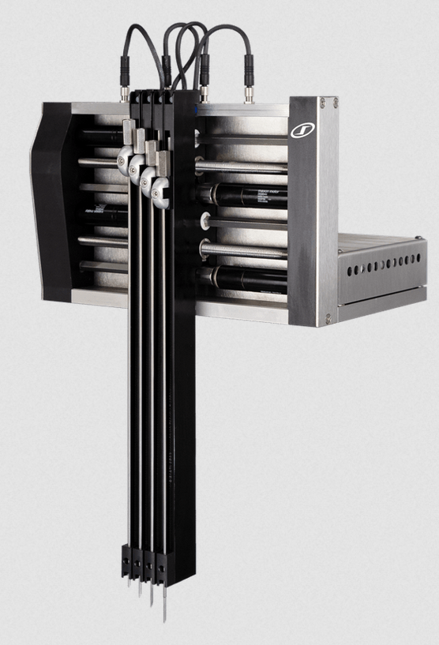
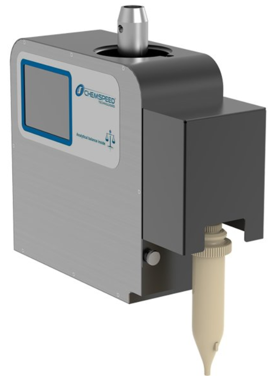
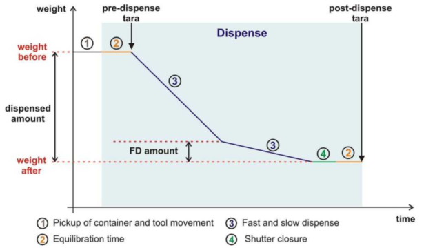
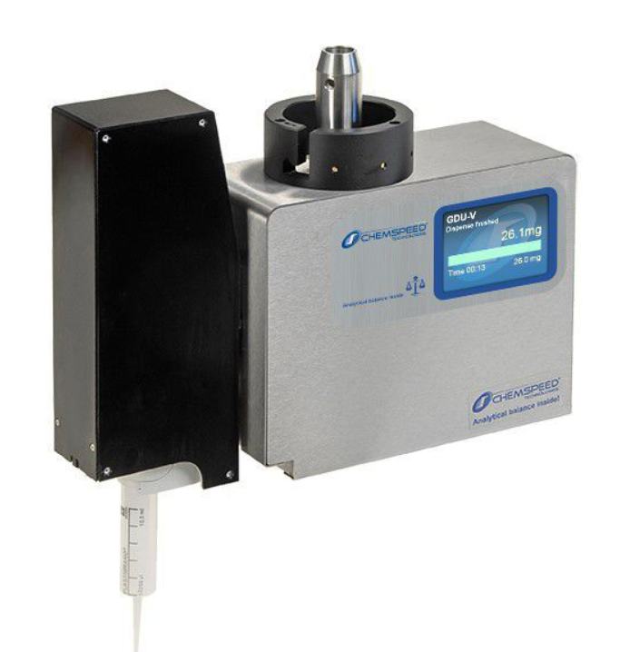
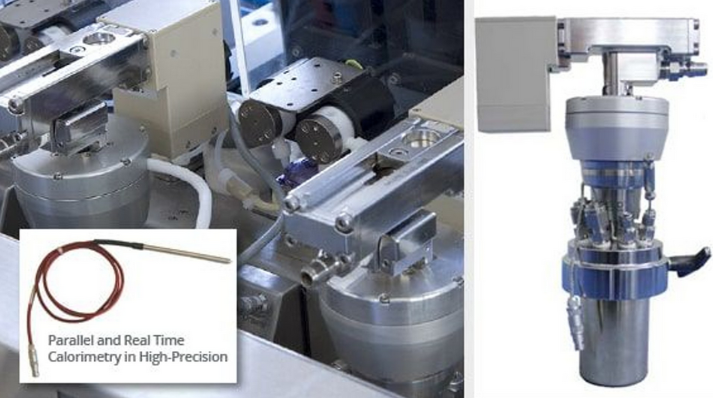
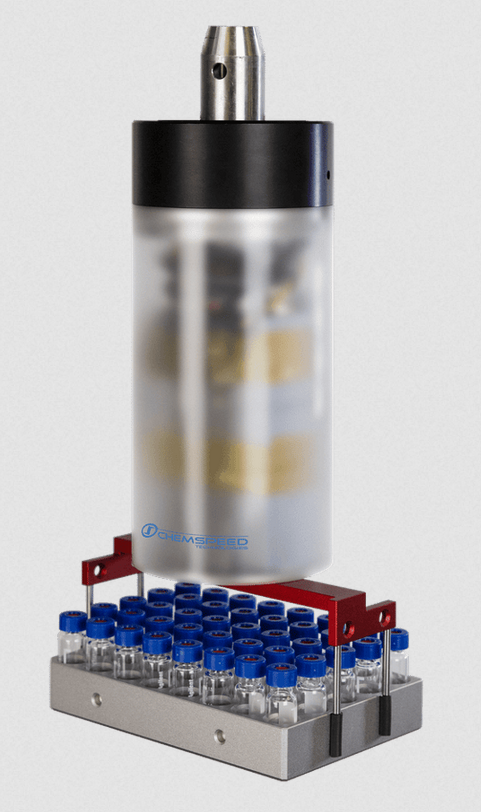
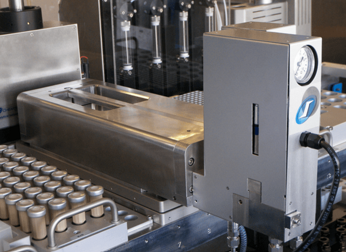

# Chemspeed Tools Overview

This page introduces the main **Chemspeed tools** integrated into the **Swing SP**, **CatScreen**, and **AutoPlant** platforms (Swing XL types).   
Reference videos with demonstrations can be found here: [Chemspeed Example Solutions](https://www.chemspeed.com/example-solutions/)

## Robotic Arm and Tools

The **Swing XL** platforms use a **4-axis robotic arm** (X, Y, Z, Alpha rotation).  
This arm mounts different **tools** to perform the most common laboratory operations, ensuring precise and automated workflows.

---

## 1. 4NH

**Description:**  
Automated liquid handling tool designed for dispensing of solvents and reagents into MTP or Paradox plates.

**Key Features:**  
- Four independent dispensing heads.  
- Repeatability and precision across multiple vials.  
- Supports different volume dispensing, from min. 0.2 ml to several ml (with multiple dispense).  
- Distribution of solvents or stock solutions.   

**Technical Specifications (typical):**  
- Dispensing precision: ±2–5%.  
- Maximum syringe volume: 1, 10 or 25 ml.  

<!-- Image: 4NH dispensing head -->

**Platforms:** Swing SP, CatScreen, AutoPlant  

---

## 2. GDU PfD (Gravimetric Dispensing Unit – Powder Fine Dosing)

**Description:**  
High-precision solid dispensing unit capable of handling powders using a **two-step principle**:  
- **Rough dosing:** delivers bulk material quickly.  
- **Fine dosing:** uses vibration or controlled feed to achieve precise target mass.

**Key Features:**  
- Accurate dosing of solid reagents without manual intervention.  
- Integrated balance for real-time feedback.  
- Ensures reproducibility across batches.  

**Technical Specifications (typical):**  
- Dosing accuracy: ±2–3% (for fine powders);
- Capacity: each container can contain up to 5 grams of powder. Minimal amount of powder needed for a proper functionality of the tool is 0.5-1 g (depending on the type of powder);
- Accuracy: **1 mg** (depending on powder type and setup);
- Optimal working range: **20 mg → 500 mg (higher amount result in a very slow dispense)**.

<!-- Image: GDU PFD unit -->

**Platforms:** Swing SP, CatScreen, AutoPlant  
---

# GDU – Principle of Operation

The **Gravimetric Dispensing Unit (GDU)** is an automated dosing system that combines a **dispensing mechanism**, an **analytical balance**, and a **real-time control algorithm** to achieve accurate additions of solids or liquids.

<!-- Image: GDU overview -->

---

## Core Concept (Closed-Loop Control)

- **Analytical balance** under the receiving vessel for continuous mass read-out;
- **Controller** that transitions from **rough dosing** to **fine dosing** near the target;
- Constant logging for **traceability** (target, actual, tolerance, timestamp).

## GDU PFD – Powder Fine Dosing

**Principle:**  
Two-stage gravimetric dosing:
1. **Rough dosing** – fast bulk transfer to approach the setpoint quickly.  
2. **Fine dosing** – uses milligram-level accuracy, stopping exactly at target mass via balance feedback.

Automation faces challenges with **powder dispensing** due to varying consistencies.  
To improve **reproducibility and accuracy** and avoid machine malfunctioning, different powder types have been **classified** with specific **GDU-PFD parameters** defined for each category.

[GDU-Pfd Parameters](https://github.com/swisscatplus/Chemspeed_Autosuite_programs/tree/main/Documentation/SwissCat%20documentation/GDU-Pfd%20Parameters){: .btn .btn-purple }

---

## 3. GDU-V (Volumetric Dispensing Unit)

**Description:**  
Tool optimized for viscous or liquid reagents. Volumetric dispensing with syringe tips. Optional Gravimetric dispensing for higher precision, with balance feedback to correct density effect.

 

**Technical Specifications (typical):**  
- Precision: ±2–3%.  
- Volume range: 10 µL – 5 mL.  
- Compatible with a viscosity range and many solvents;
- Precision: **±1–2%**;
- Different syringe tips according to amount volume to dispense;
- Optimal volume range: **15 µL → 5 mL (according to the syringe tip)**.

<!-- Image: GDU-V unit -->

**Platforms:** Swing SP, CatScreen, AutoPlant  

---

## 4. PD Reactors and PD Module (240 mL)

**Description:**  
Large-volume **Process Development (PD) reactors** for optimization and kinetic studies.
Allows the reaction scale-up after screening and process optimization. Reactions can be run under inert or reactive gas.

**Key Features:**  
- Reactor volume: 240 mL;
- Parallel operation in up to 3 PD reactors;  
- Integrated stirring, heating, cooling, and pressurization;  
- Direct coupling with analytical instruments.  

**Technical Specifications (typical):**  
- Volume range: up to 200 mL effective scale-up.  
- Temperature: –20 °C to +150 °C.  
- Pressure: up to 80 bar.  

<!-- Image: PD reactors -->

**Platforms:** AutoPlant (dedicated)  

---

## 5. Gripper MTP / Eccentric Gripper

**Description:**  
Robotic handling tools for manipulating Paradox plates, vials, or reaction blocks.

**Key Features:**  
- MTP gripper for Paradox and MTP plates.  
- Eccentric gripper for non-standard geometries.  
- Automated transfer within and between modules.
- Handling capacity: up to 1-2 kg.  
  

<!-- Image: Gripper MTP -->

**Platforms:** Swing SP, CatScreen, AutoPlant  

---

## 6. Heating Plate / Shaker

**Description:**  
Combined heating and agitation system for reaction plates and vials.  
Uses **electrical heating (Heather SHK)** and **oil-based cooling (cryostat)** and the provides real-time feedback during the workflow.
The control of temperature and shaking/stirring is indipendent.

**Technical Specifications (typical):**  
- Temperature range: –20 °C to +150 °C. 
- Uniform heating across wells (max. ±0.5 °C). 
- Shaking speed: 100–500 rpm (200 rpm preferred to minimize vibrations). 
- Stirring speed: 100-1000 rpm

**Platforms:** Swing SP, CatScreen, AutoPlant  

---

## 7. MTP Pressure Block

**Description:**  
Specialized reactor block for parallel reactions under controlled pressure.  
Compatible with 48- and 96-well Paradox or MTP plates.

**Technical Specifications (typical):**  
- Allows gas pressurization of entire reaction plate.   
- Safety interlocks for overpressure.
- Pressure up to 80 bar for H₂ gas. 
- Pressure up to 10 bar for inert gas (N₂ and Ar) or other reactive gases (CO, CO₂, acetylene),
- Temperature range: –20 °C to +150 °C. 

<!-- Image: MTP Pressure Block -->

**Platforms:**  CatScreen  

---