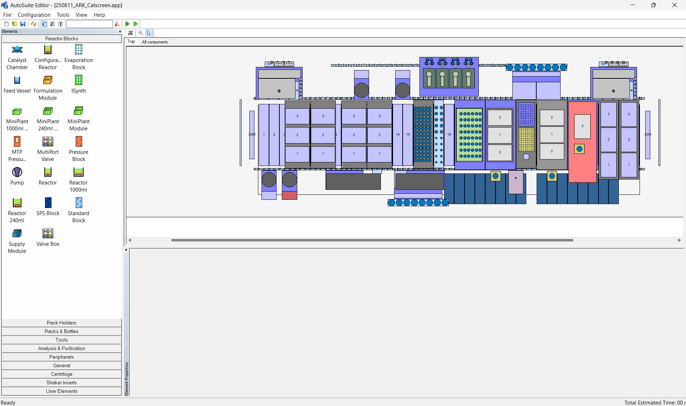
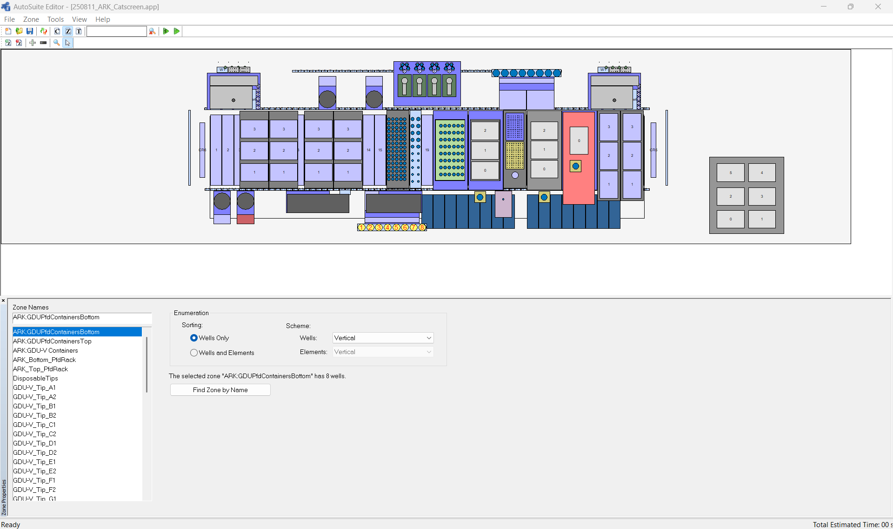
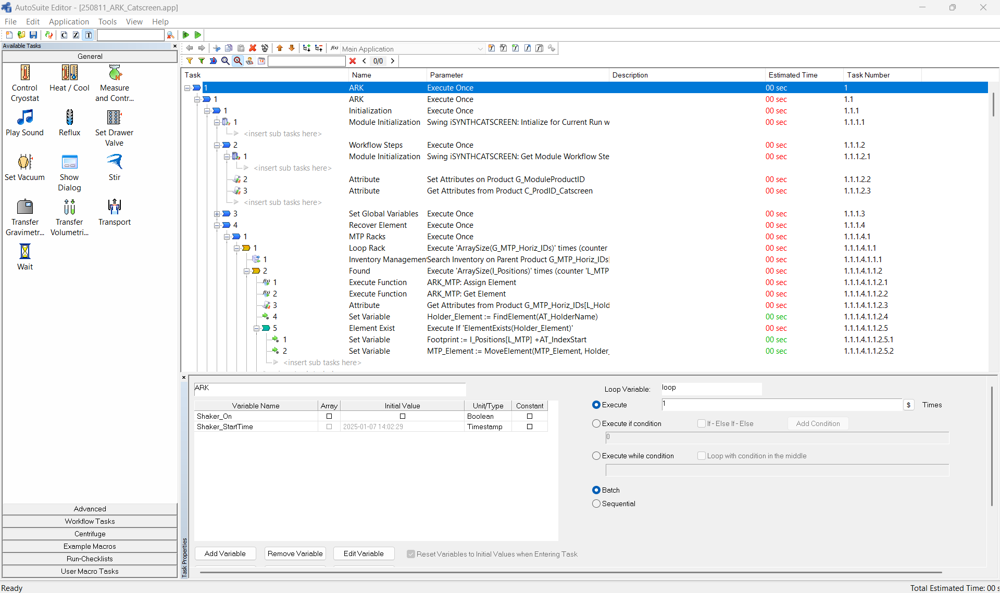
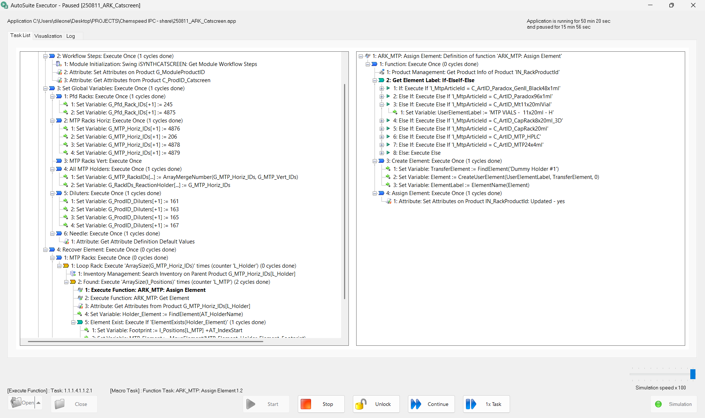
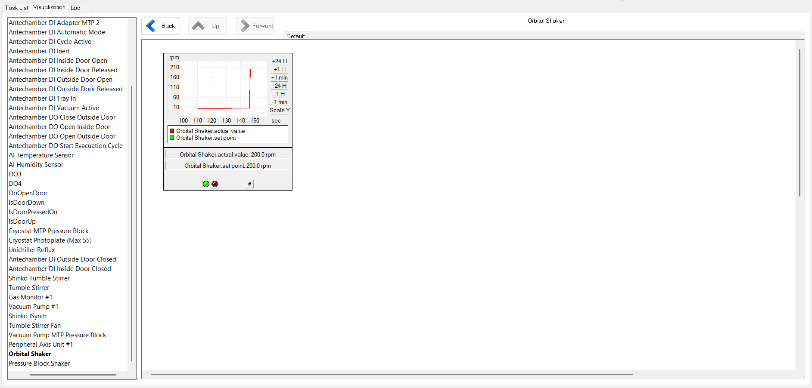
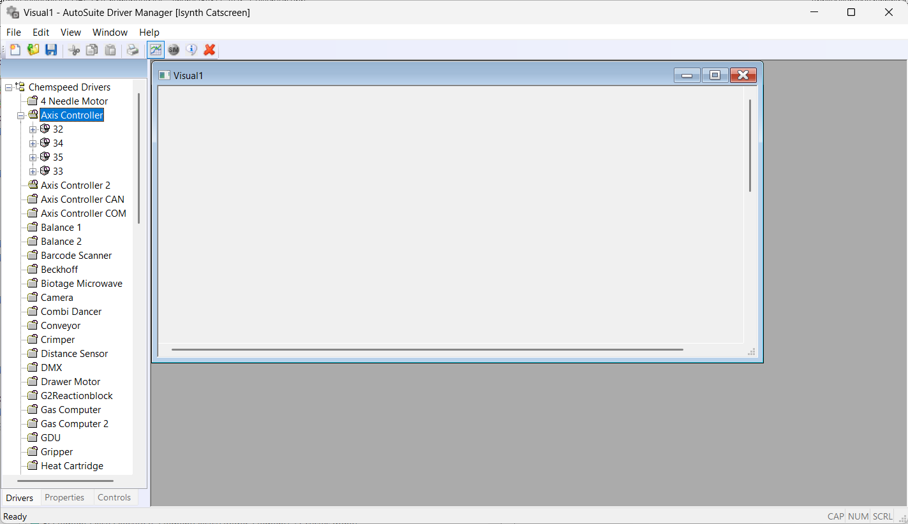

# AutoSuite – Basic Guide

A concise introduction to the core areas of **AutoSuite**: the **Editor** (Configuration, Zone, Task), **Simulation**, **Executor**, and **Driver Manager**.

---

## 1. Editor

### Configuration Section
- Defines the **overall platform setup** (tools, peripherals).
- Ensure hardware and software options are correctly selected.

<!-- Image: AutoSuite Configuration section -->

### Zone Section
- Organizes **physical/logical areas** where tasks will run (e.g., plates, reactors, container holders).
- Each **Zone** corresponds to a specific experimental unit.

<!-- Image: AutoSuite Zone section -->

### Task Section
- Defines the **sequence of operations** (dosing, stirring, heating, etc.).
- Each **Task** is an actionable step executed by a specific driver.
- Tasks are arranged in the **timeline** within a Zone.

<!-- Image: AutoSuite Task section -->

---

## 2. Simulation
- Runs a **simulation** of the workflow. Allows multiple simulations to run in parallel. 
- Detects **errors, missing zones, or driver conflicts** before execution.
- Ensures the workflow is **logically consistent** and resources are available.

<!-- Image: AutoSuite Simulation window -->

---

## 3. Executor
- Handles **real-time execution** of the experiment.
- Reads configuration and tasks, then **dispatches commands** to hardware.
- Shows **live progress**, status, and feedback from instruments.

<!-- Image: AutoSuite Executor interface -->

---

## 4. Driver Manager
- Utility for **configuring and controlling device drivers**.
- Allows manual **connect/disconnect/reset** of drivers and quick diagnostics.
- Useful for **troubleshooting** or controlling equipment **outside** a running experiment.

<!-- Image: AutoSuite Driver Manager panel -->

---