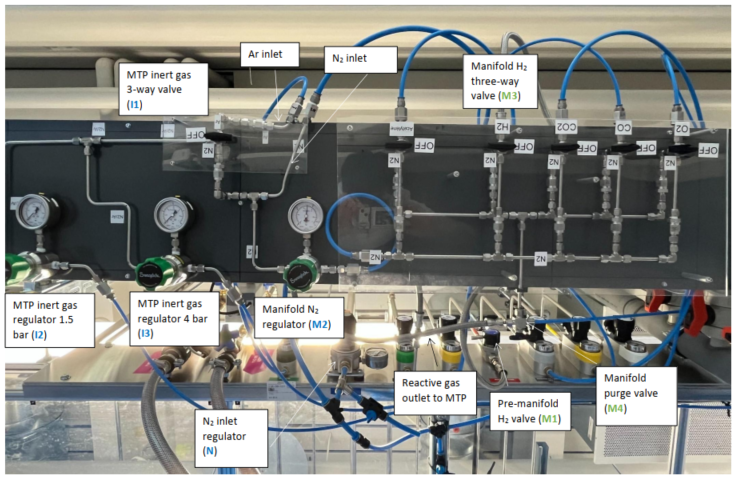
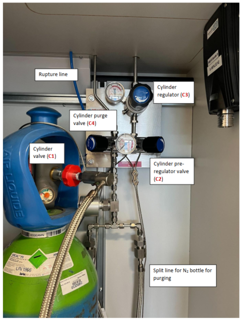
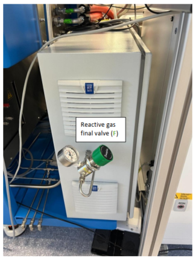

# High-Pressure Reactive Gases – CatScreen

This procedure describes the use of **H₂ up to 80 bar** on the **CatScreen** as an example. The steps are, in principle, also applicable to **other reactive gases** and the **AutoPlant**.

<!-- Replace with actual image path -->

---

## Turning on N₂ in inert and reactive gas lines

### A) Start the N₂ line
1. **N** should be **open** by default. If not, **open N** and set to **7 bar** *(blue lines withstand up to 10 bar)*.  
2. **M2** should be **open** by default. If not, **open M2** to a reasonable pressure (e.g. **1 bar**).  
   > This N₂ line is used to **flush the reactive gas lines**, preventing gas mixing.  
3. Turn **I1** to **“N₂”** to feed the **inert gas line of the reactor**.  
4. Open **I2** or **I3** to the desired pressure (two regulators available: **up to 1.5 bar** and **up to 4 bar**).  

### B) Flush manifold and MTP Pressure Block with N₂
1. Ensure the **MTP Pressure Block** is **not under pressure**. Otherwise, **depressurize safely** (see dedicated section).  
2. Set **M3** to **“N₂”**. **Wait 10 seconds** to flush the manifold.  
3. Set **M3** to **“OFF”**.  

---

## Turning on H₂ from the cylinder (if closed at regulator C3)

Before starting: make sure **C1, C2, C3, C4 and M1 are closed** and **M3 is set to “OFF”**.  
> If the other workstation is not in use, check that its **manifold inlet is closed** (e.g. if using CatScreen, verify the AutoPlant inlet is closed).  

1. **Open C1.**  
2. **Open C2.**  
3. **Open C3** to the **maximum pressure** required for the experiment.  
4. **Open M1.**  
5. Check that **M4** points **to the left** (thick metal line).  
6. Set **M3** to **“H₂”** (or the desired gas).  
7. **MTP Pressure Block (CatScreen):** open **F** until the **target pressure** is reached.  

<!-- Replace with actual image path -->

---

## Setting the reactor to “Closed under Pressure”

- **MTP Pressure Block (CatScreen):** ensure **F** is **closed** when required.  
- **PD Reactor (AutoPlant):** set **C3** to the **correct experimental pressure**.  

> Once ready to pressurize: set **M3 to “H₂”** and, for the MTP Pressure Block, **open F** until the target pressure is reached.  

<!-- Replace with actual image path -->

- [ ] The **same procedure** applies to **other gases** by connecting a different cylinder in the cabinet and opening the corresponding manifold valve.  
- [ ] The cylinder is connected to both the **workstation** and the **AutoPlant**; **before the PD reactors there is no regulation**, only **ON–OFF**. **Always double-check manifolds on both workstations** before starting a new experiment.  

---

## Shutting down inert and reactive gas lines

### Option 1 — Turn off **H₂ at the cylinder** (not necessary for short-term breaks)

**A) Safely depressurize the manifold**  
1. **Close C1**, **leave M1 open**, and keep **M3 on “H₂”**.  
2. **Safely depressurize reactor and manifold** (see section below). Since the line up to the cylinder is open, the entire line will depressurize. Check at **C3** that pressure drops to **0**.  
3. **Close C2.**  
4. **Close C3.**  
5. **Close M1.**  
6. Set **M3** to **“OFF”**.  

**B) During the reaction**  
- If the **emergency stop button** was pressed while the reactor was under pressure, **depressurize reactor and manifold safely** (see below).  

### Option 2 — Turn off **H₂ at the manifold only**  
1. Set **M3 to “OFF”** and leave **C1/C2/C3/M1 open**.  
2. **Safely depressurize reactor and manifold** (see below).  
   > Note: the **H₂ line from cylinder to M3** remains pressurized.  

### Flushing manifold and reactor with N₂  
1. Ensure **reactor and manifold are not under pressure**. Otherwise, **depressurize safely** (see below).  
   > This can happen if the **emergency stop button** was pressed and the software did not release pressure at the end of the task.  
2. Set **M3** to **“N₂”**. If setting up for a different reactive gas next, use the **M3 valve corresponding to that gas**.  
3. Set **M4** **to the right** (blue line). **Wait 10 s**.  
4. Set **M4** **to the left** (thick metal line). **Wait 10 s**.  
5. **Repeat steps 3–4** two more times.  
6. Set **M3** to **“OFF”**.  
7. **MTP Pressure Block (CatScreen):** close **F**.  

### Turning off the N₂ line  
1. **Close I2** or **I3**.  
2. Turn **I1** to **“OFF”**.  
3. **Leave N open**.  

---

## Safely depressurizing reactor and manifold

1. To **depressurize everything** (including the line to the cylinder), **close C1**.  
   To depressurize **only reactor + manifold**, set **M3 of the gas** (e.g. H₂) to **“OFF”**.  
2. If the **emergency button** was pressed, the reactor may still be under pressure:  
   a. Open **Driver Manager**.  
   b. Right-click **G2ReactionBlock** → **Configure and Control**.  
   c. Click **Closed Inert Gas** and **wait until reactor depressurizes**.  
3. If the reaction finished successfully, the reactor should **automatically depressurize and clean itself**, but **manifold/cylinder line** may still be pressurized. Then:  
   a. Open **Driver Manager**.  
   b. Right-click **G2ReactionBlock** → **Configure and Control**.  
   c. Click **Closed Inert Gas**.  
   d. Perform **3 cycles** of **“Pressure” → “Closed Inert Gas”** to fully depressurize the manifold (and optionally the cylinder line).  
4. Perform **3 cycles** of **“Cleaning” → “Closed Inert Gas”** to remove reactive gas residues from the reactor.  
5. If full depressurization (including the cylinder line) was intended, now **close C2, C3 and M1** and set **M3 to “OFF”**.  

---

> **Safety**  
> - Always operate in compliance with **internal procedures** and **risk assessments**.  
> - Use appropriate **PPE** and **protective shields** where required.  
> - Never exceed the **pressure limits** of lines and components.  
> - In case of anomalies, **stop operations immediately** and notify the supervisor.  
