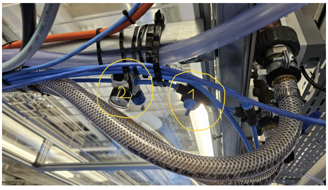
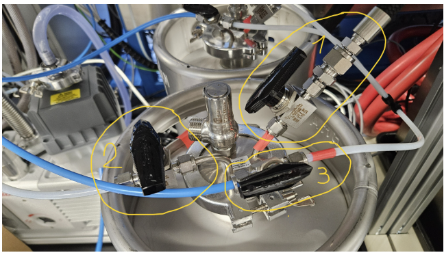
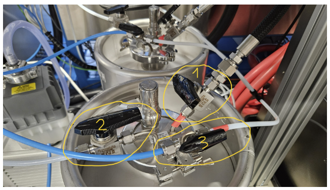

# Emptying Chemspeed 17-Liter Metal Solvent Bottles

This procedure applies to the **Chemspeed Swing SP** and **CatScreen** metal solvent **waste** bottles.

> **Safety**  
> - Pressurize with **N₂ only** and **do not exceed 1 bar** on the gauge.  
> - Open valves **slowly** to control discharge rate and avoid splashing.  
> - Use appropriate **PPE** and follow local waste disposal rules.

---

## Step-by-Step Procedure

1. **Pressurize the bottles with N₂** from the top of the gloveboxes.  
   - **Valve No. 1**: **Open** to supply N₂ (in normal glovebox operation this valve is **closed**).  
   - **Gauge No. 2**: Ensure the reading **does not exceed 1 bar**.

<!-- Image: Overview of N₂ valve and gauge -->


2. **Isolate the glovebox → waste circuit**  
   - Move the **2-way valve (black) No. 1** to **close** the glovebox→waste circuit.

3. **Route flow to the waste outlet**  
   - Move the **2-way valve No. 2** **to the left** (toward the **white pipe**) to fill a suitable waste container (e.g., **5 L**).

4. **Pressurize the outlet line with N₂**  
   - Move the **3-way valve No. 3** **to the left** (toward the **blue pipe**) to apply N₂.  
   - **Open gradually** to control the waste outflow speed.

<!-- Image: Normal glovebox operating position of valves -->

Photo No. 1, valves in the normal Glovebox operating position.

<!-- Image: Valve positions for emptying the 17-L waste bottles -->

Photo No. 2, valve in the position for emptying the solvent waste contained in the 17-liter metal bottles (5 liters of waste to bottles to be disposed of).

> **After transfer is complete:**  
> Return all valves to the **normal operating position** (as shown in the *Normal Operation – Valves* image).

---

## Notes
- Always **open valves slowly**.  
- Verify container capacity (e.g., **5 L**) and labeling before transfer.

---

## Chemspeed ↔ Glovebox Interior Doors (I/O Controller)

Use the following **I/O Controller** settings to **open/close** the interior doors between **Chemspeed** and the **glovebox**:

```text
IO Controller    0-0

Open:  DO4 = 0    DO3 = 1*    DO1 = 1
Close: DO1 = 0*   DO3 = 0     DO4 = 1

* wait
```

---


# Grease Procedure

ISOFLEX NBU 15
High-performance grease recommended for precision mechanics on Chemspeed systems.

**Reference link:**  
[ISOFLEX NBU 15 – Klüber Lubrication](https://www.klueber.com/ch/de/produkte-service/produkte/isoflex-nbu-15/304202/)

## Where to Use
- **Z–A axis**: infinite (lead) screw
- **4NH**: dispensing head mechanical components

> Apply a thin, even film on clean components. Avoid contaminating sensors, belts, and dispensing paths.


