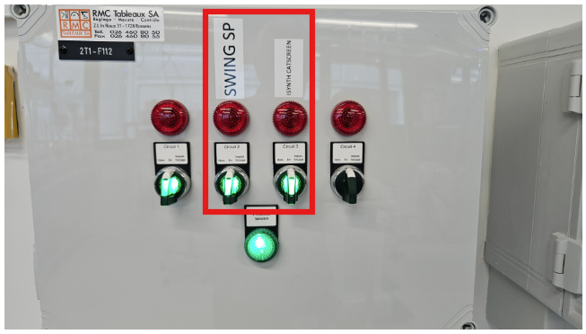
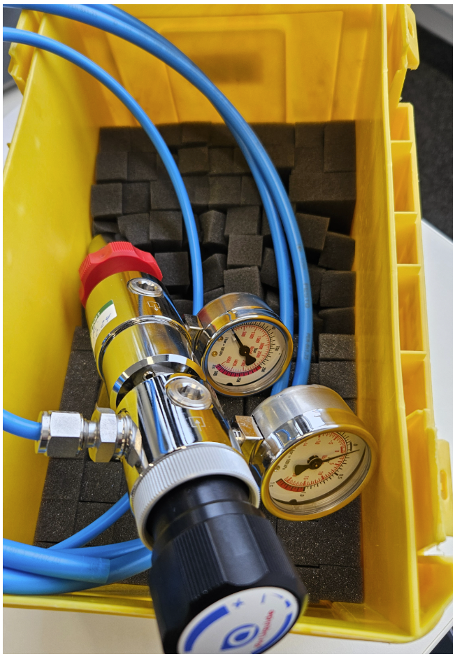
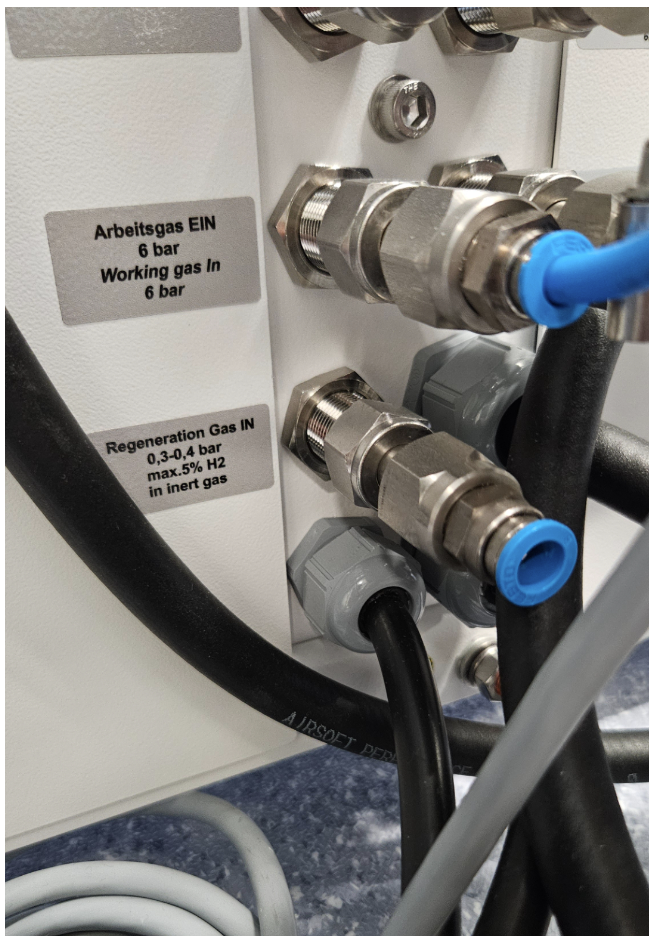
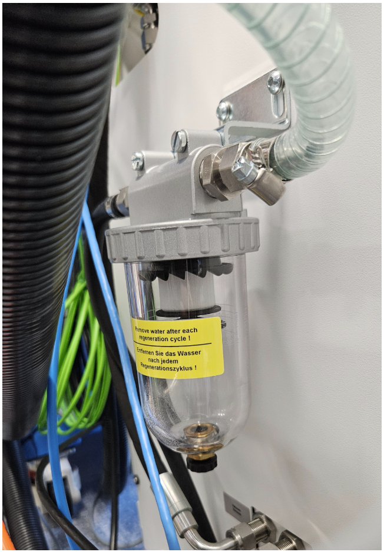
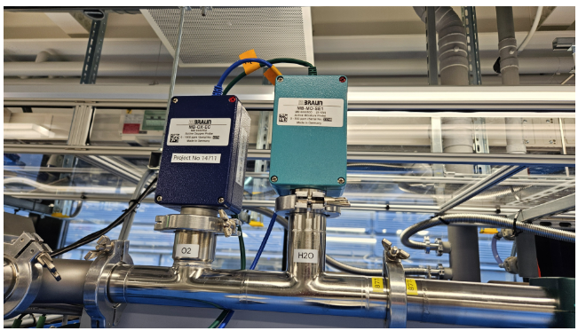
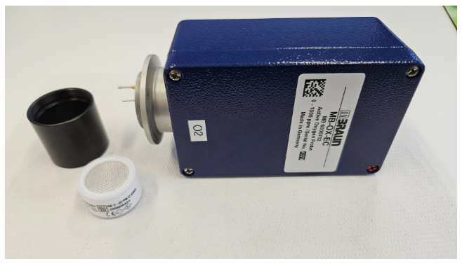

# How to Start the Regeneration – MBraun

**Attention!** Before each regeneration of the anti-O2 and H2O catalyst, ensure that the **cooling water circulation is active**.  
The **green light** for the Chemspeed SP (circuit 2) and ISYNTH CatScreen (circuit 3) must be lit on the wall box.  

<!-- Image: Cooling water circulation indicator -->

---

## Catalyst Regeneration Video

Watch the following YouTube video for catalyst regeneration:  
[▶ Catalyst Regeneration – YouTube](https://www.youtube.com/watch?v=WrWLRE6FoWI)

---

## Gas Cylinder Connection

The gas cylinder must be connected with the pressure regulator at the following location:  
**Catalyst regeneration gas in the Glove Box (Formier gas 95% N₂ + 5% H₂)** – ARCAL F5 Smartop 50L 200 bar cylinder.  

<!-- Image: Gas cylinder connection -->

(The pressure gauge to use is located **in the white cabinet in the hallway**)
---

## End of Regeneration

At the end of the regeneration process, empty the container filled with water.  

<!-- Image: Water container -->

---

# Starting and Stopping the MBraun Glovebox

If the reactor has already been regenerated, proceed. Otherwise, perform regeneration (see video above).

### Starting
1. Close the Glovebox with the panels.  
2. On the **Siemens Sismatic HMI** panel, press **Box 1**.  
3. Select **Functions → Vacuum Pump VPG → Box Purge** (purges with N₂ at 250 L/min).  
4. Wait approx. 60 minutes.  
5. **Caution:** Replace the O₂ sensor on the top-left of the Glovebox roof.  
6. Select **Analyze**. If H₂O and O₂ < 100 ppm, stop Box Purge and select **Circulation Reactor 1**. Otherwise, continue purging.  
   - Normal values: < 1 ppm.  
7. Turn on the solvent filter (activated carbon). **LMF ON** turns green.  
8. Leave the glovebox in **Circulation Reactor** mode for normal operation.  

---

### Decommissioning
1. In **Functions**, deselect **Analyzer** and then **Circulation Reactor 1**.  
2. Press **Box Purge** for ~10 minutes.  
3. During purge, **remove the O₂ sensor**.  
4. Deselect **Box Purge** and **Vacuum Pump VPG**; set **LMF filter** OFF.  
5. Deselect **Box 1**.  
6. Remove the panels.  

**CAUTION:** Always remove the O₂ sensor and store it in its sealed case (white cabinet) to prevent deterioration of the capsule.  

---
# Sensors

<!-- Image: O2 sensor housing -->

## O₂ Sensor

- Location on the MBraun glovebox.  
- Position of the waterproof housing in the probe box.  
- White capsule inside the O₂ probe.  

<!-- Image: O2 probe capsule -->

---

# Cleaning the H₂O Sensor

See the following YouTube video for instructions:  
[▶ Cleaning the MBraun H₂O Analyzer](https://www.youtube.com/watch?v=wHVVfeNDNkA)

---

# Glove Substitution

Refer to the following document:  
[Glove Substitution PDF](./../../../assets/pdf/2609255-EN_Gloveport_oval-long_V5.1_240813.pdf)

---

# Oil Change for Vacuum Pump

Follow the procedure in the video:  
[▶ Vacuum Pump Oil Change](https://shop.mbraun.de/ENU/26062/Item.aspx?ItemNo=1510801)

Purchase oil from MBraun:  

<!-- Image: Oil for vacuum pump -->

When changing the oil, also replace the filter (purchase from MBraun):  

<!-- Image: Oil filter -->

---