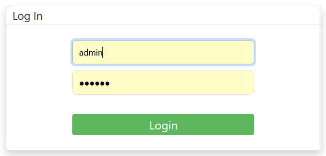
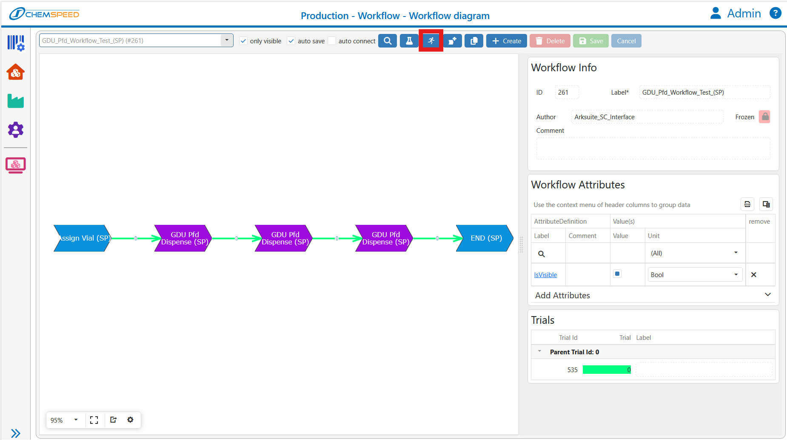
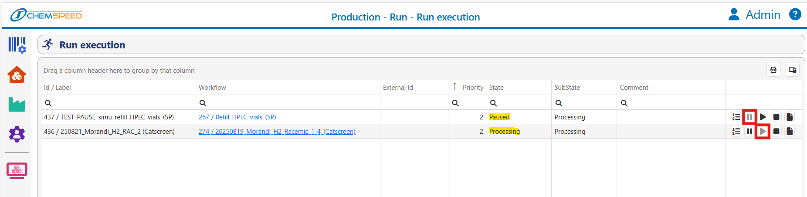
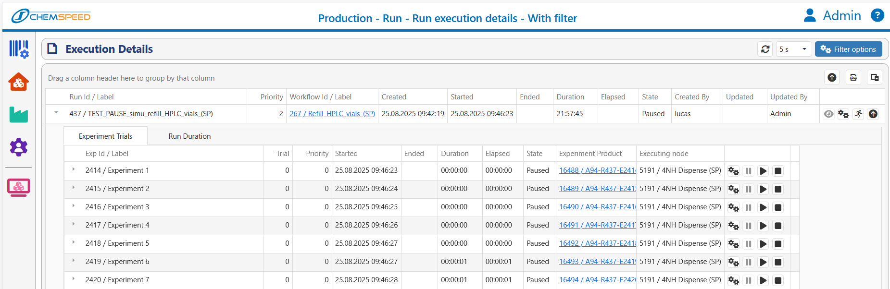

# ArkSuite — quick run creation & execution

> How to create, queue, and monitor a Run from a Workflow, then execute it with AutoSuite (simulation or execution).  
> **Platforms**: Swing SP & Catscreen.

---

## 1) Log in

---

## 2) Create the workflow with a Python script
- **(Placeholder)**: *Upload/attach the Python-generated AutoSuite workflow here.*  
  *(to be completed)*

---

## 3) Visualize the workflow
- Navigate: **Production → Workflow → Workflow Diagram**.  
  Pick the workflow from the dropdown. Use **Create Run** (running-man icon) to start a run from this workflow.  
  :contentReference[oaicite:1]{index=1}

- Note: Once a workflow is used to create a run it becomes **Frozen**; use **Save as** to copy/unlock for edits.  
  :contentReference[oaicite:2]{index=2}

---

## 4) Create a Run
**Option A (recommended)**  
- From the **Workflow Diagram**, click **Create Run** → fill **Label** (≥5 chars), optional External ID & Comment → **Save**.  
  :contentReference[oaicite:3]{index=3}

**Option B (copy)**  
- Go to **Production → Run → Run Entry**, search/select a run → **Duplicate** to copy settings.  
  :contentReference[oaicite:4]{index=4}

**Simulation naming**  
- For simulations, include **`SIMU_`** in the Run label or in the comment.

---

## 5) Queue the Run
- In **Run Entry**, click **Queue run**.  
  If your site uses ERP release: **Release run to operator** first, then queue it from **Run Operating → Overview**.  
  :contentReference[oaicite:5]{index=5}

---

## 6) Start AutoSuite (Simulation or Execution)
- Open the **AutoSuite** desktop app and choose **Simulation** or **Execution**.
- AutoSuite idles in a **“Waiting for work”** loop until ArkSuite assigns a queued workflow to the target node/platform.

---

## 7) Monitor execution & control
- Live queue/status: **Production → Run → Run Execution** (or **Run Operating → Execution**, site-dependent).  
  Actions: **Change Priority**, **Pause**, **Start/Resume**, **Cancelled**.  
  **Run States**: *Created, Queued, Processing, Paused, Complete, Canceled, CompletedWithErrors*.  
  :contentReference[oaicite:6]{index=6}

- Per-experiment details: from **Run Entry**, click **Open execution details** to see each node’s inputs/outputs. 
  :contentReference[oaicite:7]{index=7}

---

## 8) Tips
- You can queue multiple workflows; if they target different platforms (e.g., iSynth vs. CATSCREEN) they run in **parallel** when resources are free.  
  :contentReference[oaicite:8]{index=8}
- After a safety stop/restart, ArkSuite resumes the workflow **from the last executed node**.  
  :contentReference[oaicite:9]{index=9}
"""
