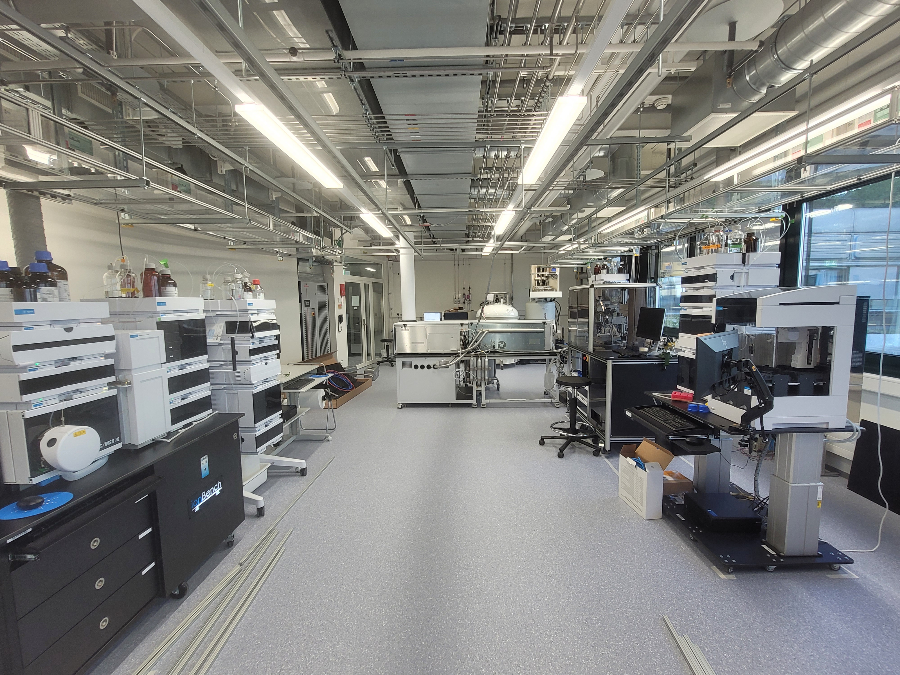

This is the Swiss CAT+ laboratory documentation. 

You will find here anything you need to start your adventure here !

You can already have a brief overview of the lab by looking at this website : [Swiss CAT+ website](https://www.epfl.ch/research/facilities/swisscat/){: .btn .btn-purple }

You can find these different sections :

- Automation
- Analysis
- IT
- Organisation of the laboratory
- Synthesis
- Documentation configuration 

The laboratory is divided into 2 main sections : the synthesis section and the analysis section.

Here is an image of the lab :

The synthesis section encomprises of multiple glove boxes and the analysis section gathers multiple Agilent and Bruker devices. Each section is explained in depth in the relevant parts. 
